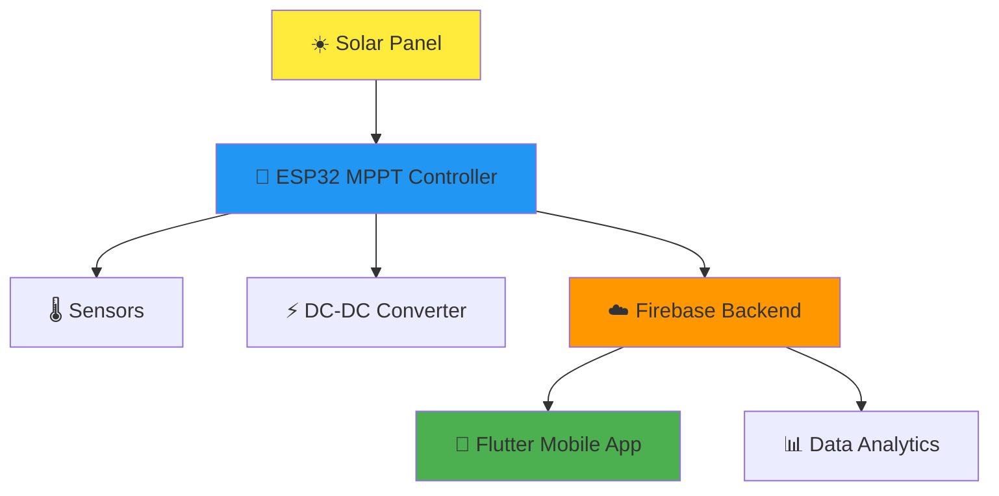
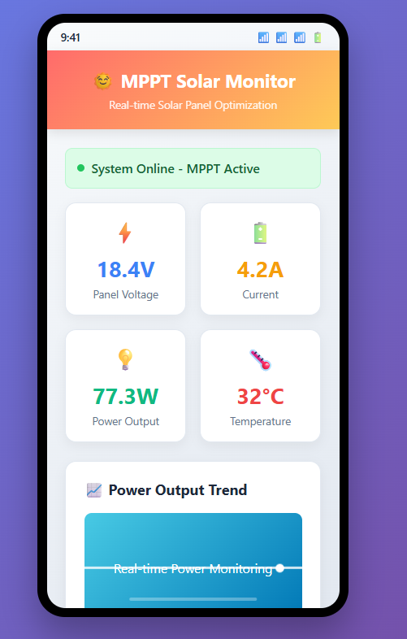

# 🌞 MPPT Solar Optimization

<div align="center">

[](https://opensource.org/licenses/MIT)
[](https://www.espressif.com/en/products/socs/esp32)
[](https://flutter.dev/)
[](https://firebase.google.com/)
[](http://makeapullrequest.com)

**🚀 Maximize your solar energy harvesting with intelligent MPPT algorithms**

[Features](#-features) • [Getting Started](#-getting-started) • [Documentation](#-documentation) • [Contributing](#-contributing)

</div>

---

## 📋 Table of Contents

- [🌟 Overview](#-overview)
- [✨ Features](#-features)
- [🏗️ System Architecture](#️-system-architecture)
- [📱 Screenshots](#-screenshots)
- [🚀 Getting Started](#-getting-started)
- [🔧 Installation](#-installation)
- [📊 Usage](#-usage)
- [🛠️ Technology Stack](#️-technology-stack)
- [📁 Project Structure](#-project-structure)
- [🤝 Contributing](#-contributing)
- [📄 License](#-license)
- [🙏 Acknowledgements](#-acknowledgements)

## 🌟 Overview

The **MPPT Solar Optimization** project is an advanced IoT solution designed to maximize energy harvesting from solar panels using state-of-the-art Maximum Power Point Tracking (MPPT) algorithms. This comprehensive system combines embedded hardware control, real-time mobile monitoring, and cloud-based data analytics to optimize solar energy collection.

### 🎯 Key Objectives

- **Maximize Energy Efficiency**: Implement intelligent MPPT algorithms for optimal power extraction
- **Real-time Monitoring**: Provide instant access to solar panel performance metrics
- **Data-Driven Insights**: Store and analyze historical performance data
- **User-Friendly Interface**: Intuitive mobile application for seamless monitoring

## ✨ Features

### 🔋 Core Functionality
- **⚡ Advanced MPPT Algorithm**: Perturb & Observe with Incremental Conductance optimization
- **📡 Real-time Data Transmission**: Seamless ESP32-to-Firebase communication
- **🌡️ Multi-parameter Monitoring**: Voltage, Current, Power, Temperature tracking
- **☁️ Cloud Data Storage**: Historical performance analytics and trend analysis

### 📱 Mobile Application
- **📊 Interactive Dashboard**: Real-time data visualization with charts and graphs
- **📈 Historical Analysis**: Performance trends and efficiency metrics
- **🔔 Smart Notifications**: Alert system for system anomalies
- **🎨 Intuitive UI/UX**: Clean, modern interface built with Flutter

### 🖥️ System Management
- **🔧 Remote Configuration**: Adjust MPPT parameters remotely
- **📝 Data Logging**: Comprehensive performance history
- **🔐 Secure Authentication**: Firebase-based user management
- **⚡ Real-time Updates**: Live data synchronization

## 🏗️ System Architecture



### 🔧 Component Overview

| Component | Technology | Purpose |
|-----------|------------|---------|
| **🎛️ ESP32 Controller** | C/C++ + ESP-IDF | MPPT algorithm implementation & sensor data collection |
| **☁️ Firebase Backend** | Cloud Firestore | Real-time data storage & synchronization |
| **📱 Mobile App** | Flutter + Dart | User interface & monitoring dashboard |
| **🔌 Hardware** | ESP32 + Sensors | Physical system control & measurement |

## 📱 Screenshots

<div align="center">
  
  <br>
  <em>Mobile App Dashboard showcasing real-time solar panel monitoring</em>
</div>

## 🚀 Getting Started

### 📋 Prerequisites

Before you begin, ensure you have the following installed:

#### 🔧 Embedded Development
- **PlatformIO IDE** or VS Code with PlatformIO extension
- **ESP32 Development Board** and toolchain
- **Hardware Components**: Voltage/Current sensors, DC-DC converter, Temperature sensor

#### 📱 Flutter Development
- **Flutter SDK** (Version 3.x.x recommended)
- **Dart SDK**
- **Android Studio** or VS Code with Flutter extension
- **Device/Emulator** for testing

#### ☁️ Firebase Setup
- **Google Firebase Account**
- **Firebase CLI** installed and configured

### ⚙️ Hardware Requirements

| Component | Specification | Purpose |
|-----------|---------------|---------|
| **Microcontroller** | ESP32 DevKit | Main processing unit |
| **Voltage Sensor** | 0-25V range | Solar panel voltage monitoring |
| **Current Sensor** | ACS712 (30A) | Current measurement |
| **Temperature Sensor** | DS18B20 | Environmental monitoring |
| **DC-DC Converter** | Buck/Boost topology | Power conditioning |

## 🔧 Installation

### 1️⃣ Embedded System Setup

```bash
# Clone the repository
git clone https://github.com/your-username/MPPT-Solar-Optimization.git
cd MPPT-Solar-Optimization/embedded

# Configure your credentials in main.c
# Update Wi-Fi SSID, password, and Firebase settings

# Build and upload to ESP32
platformio run --target upload

# Monitor serial output (optional)
platformio device monitor
```

### 2️⃣ Firebase Configuration

```bash
# Install Firebase CLI
npm install -g firebase-tools

# Login to Firebase
firebase login

# Navigate to Firebase directory
cd ../firebase

# Deploy Firestore rules
firebase deploy --only firestore:rules
```

### 3️⃣ Flutter Mobile App

```bash
# Navigate to Flutter app directory
cd ../flutter_mppt_app

# Install dependencies
flutter pub get

# Add Firebase configuration files
# Place google-services.json in android/app/
# Place GoogleService-Info.plist in ios/Runner/

# Run the application
flutter run
```

## 📊 Usage

### 🎯 Quick Start Guide

1. **🔌 Hardware Setup**: Connect your solar panel to the ESP32 controller
2. **📡 Network Connection**: Ensure ESP32 is connected to Wi-Fi
3. **📱 Launch App**: Open the MPPT Solar Optimization mobile app
4. **📊 Monitor Data**: View real-time solar panel performance metrics

### 📈 Dashboard Features

- **⚡ Real-time Power**: Live power output monitoring
- **🔋 Voltage/Current**: Instantaneous electrical parameters
- **🌡️ Temperature**: Environmental conditions tracking
- **📊 Historical Charts**: Performance trends and analytics
- **🔔 Alerts**: System status notifications

## 🛠️ Technology Stack

<div align="center">

| Layer | Technology | 
|-------|------------|
| **🖥️ Frontend** |  |
| **☁️ Backend** |  |
| **🎛️ Embedded** |  |
| **💾 Database** |  |
| **🔧 Tools** |  |

</div>

## 📁 Project Structure

```
MPPT-Solar-Optimization/
├── 🎛️ embedded/                     # ESP32 MPPT controller firmware
│   ├── src/main.c                   # Main application logic
│   ├── include/mppt.h               # MPPT algorithm headers
│   └── platformio.ini               # PlatformIO configuration
├── 📱 flutter_mppt_app/             # Flutter mobile application
│   ├── lib/
│   │   ├── core/                    # Core business logic
│   │   ├── features/dashboard/      # Dashboard UI components
│   │   ├── shared/                  # Shared utilities
│   │   └── main.dart                # Application entry point
│   ├── android/app/google-services.json
│   └── pubspec.yaml                 # Flutter dependencies
├── ☁️ firebase/                     # Firebase backend configuration
│   ├── firebase.json                # Firebase project config
│   └── firestore.rules              # Database security rules
└── 📄 README.md                     # Project documentation
```

## 🤝 Contributing

We welcome contributions from the community! Here's how you can help:

### 🎯 Ways to Contribute

- 🐛 **Bug Reports**: Found an issue? Open a GitHub issue
- 💡 **Feature Requests**: Have an idea? We'd love to hear it
- 🔧 **Code Contributions**: Submit pull requests for improvements
- 📚 **Documentation**: Help improve our documentation

### 🔄 Development Workflow

1. **🍴 Fork** the repository
2. **🌿 Create** a feature branch: `git checkout -b feature/amazing-feature`
3. **💻 Commit** your changes: `git commit -m 'Add amazing feature'`
4. **🚀 Push** to the branch: `git push origin feature/amazing-feature`
5. **🔀 Submit** a Pull Request

### 📋 Contribution Guidelines

- Follow existing code style and conventions
- Write clear, concise commit messages
- Add tests for new features
- Update documentation as needed
- Ensure all tests pass before submitting

## 📄 License

This project is licensed under the **MIT License** - see the [LICENSE](LICENSE) file for details.

```
MIT License - Feel free to use, modify, and distribute! 🎉
```

## 🙏 Acknowledgements

- **🌟 ESP-IDF Community**: For excellent embedded development framework
- **💙 Flutter Team**: For the amazing cross-platform development toolkit
- **🔥 Firebase**: For robust backend infrastructure
- **☀️ Solar Energy Community**: For inspiration and technical guidance

---

<div align="center">

**⭐ Star this repository if you find it helpful!**

**🤝 Connect with us**

[](https://github.com/your-username)
[](https://linkedin.com/in/your-profile)

**Made with ❤️ for sustainable energy solutions**

</div>